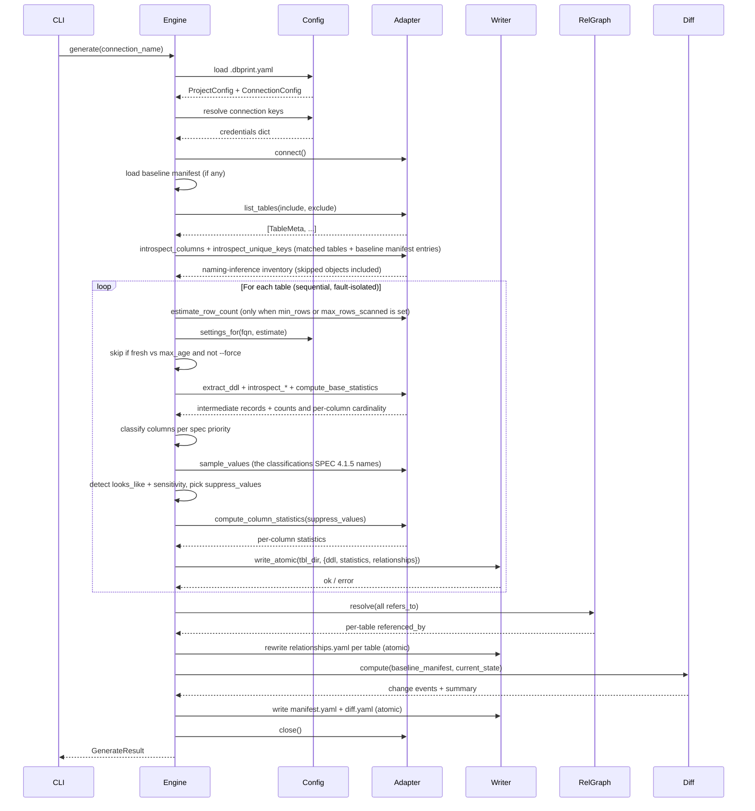
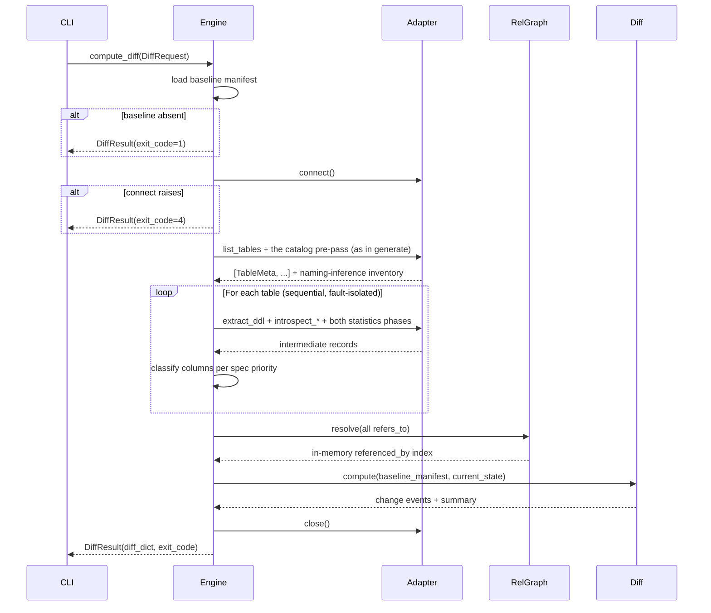
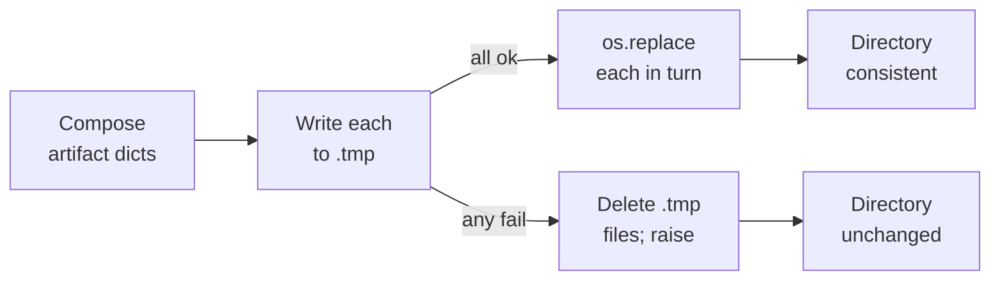
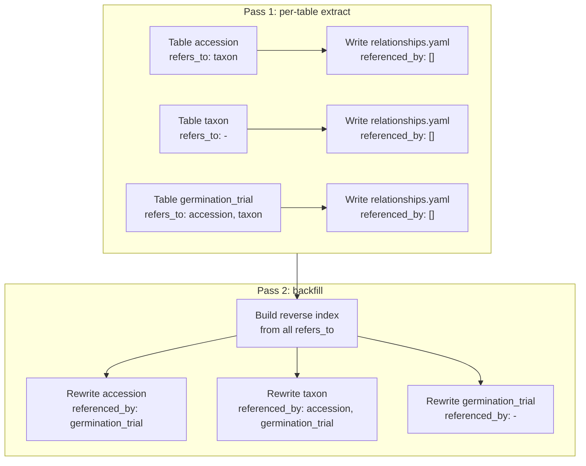
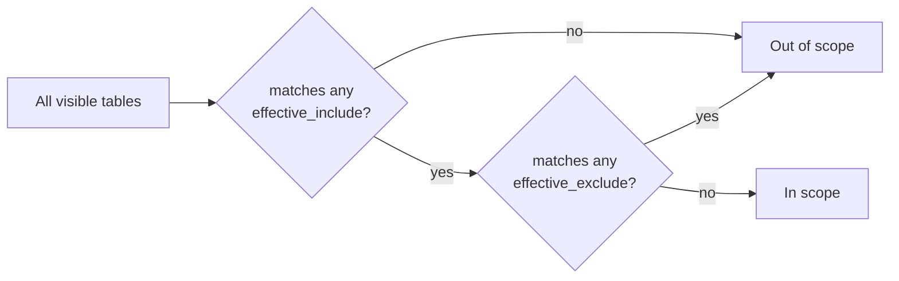
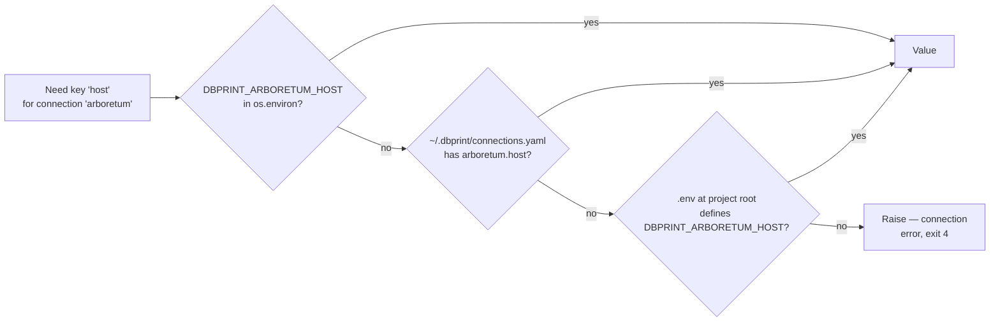

# dbprint — internal architecture

Internal design reference for the dbprint reference implementation. Describes
how the source tree is organized, how the pieces fit together at runtime, and
the patterns each subsystem follows.

The format itself — the externally normative artifact this implementation
produces — is specified in [`format/v1/SPEC.md`](format/v1/SPEC.md). The spec
governs the on-disk contract; this document governs the code that produces
and validates conformant output. Where this document and the spec appear to
overlap, the spec is authoritative.

Audience: engineers working on this codebase. Not end users (they read the
package README and the CLI help). Not other format producers (they read the
spec).

---

## 1. Module map

This map is maintained by hand. It is not generated from the tree and no test
checks it, so when a package is added the map has to be updated in the same
change. Treat a mismatch as a bug in this document, not in the code.

```
.
├── src/dbprint/
│   ├── cli/                                # Click + rich-click CLI surface
│   │   ├── main.py                         #   root command + subcommand wiring
│   │   ├── commands/                       #   one module per subcommand
│   │   ├── rendering/                      #   TTY (Rich panels) vs piped (plain lines)
│   │   ├── adapter_registry.py             #   adapter-name -> adapter class lookup
│   │   ├── engine_setup.py                 #   credentials -> adapter -> Engine, for one connection
│   │   ├── thresholds.py                   #   per-table freshness thresholds without a database
│   │   ├── options.py                      #   the shared --project locator + remote helpers
│   │   ├── run_log.py                      #   per-run log under ~/.dbprint/logs/, 3 kept
│   │   └── resolution.py                   #   implicit connection resolution
│   ├── config/                             # On-disk configuration loaders
│   │   ├── project.py                      #   .dbprint.yaml schema + discovery
│   │   ├── connections.py                  #   ~/.dbprint/connections.yaml + env + .env
│   │   ├── remote.py                       #   git-address --project: parse, then clone into a cache
│   │   └── selectors.py                    #   fnmatch-based include/exclude matching
│   ├── adapters/                           # Database adapters
│   │   ├── base.py                         #   Adapter ABC + intermediate dataclass types
│   │   ├── errors.py                       #   QueryFailed - statement + params on failure
│   │   ├── dialect.py                      #   per-adapter SQL dialect declarations
│   │   ├── trace_context.py                #   per-statement SQL tracing into the run log
│   │   ├── mock.py                         #   deterministic in-memory adapter (for tests)
│   │   ├── postgres/                       #   concrete adapter package
│   │   ├── mysql/                          #   concrete adapter package
│   │   ├── snowflake/                      #   concrete adapter package
│   │   ├── duckdb/                         #   concrete adapter package - in-process, no server
│   │   ├── clickhouse/                     #   concrete adapter package - refuses an unmaterialized sample
│   │   ├── redshift/                       #   concrete adapter package - refuses an unmaterialized sample
│   │   ├── databricks/                     #   concrete adapter package - degrades to an unmaterialized sample
│   │   └── bigquery/                       #   concrete adapter package - refuses an unmaterialized sample
│   ├── engine/                             # Orchestration layer
│   │   ├── orchestrator.py                 #   Engine.generate() top-level flow
│   │   ├── writer.py                       #   atomic per-table writes
│   │   ├── relationship_graph.py           # two-pass refers_to -> referenced_by
│   │   ├── inference.py                    #   foreign keys derived from column naming
│   │   ├── diff.py                         #   baseline-vs-target change-event computation
│   │   ├── baseline.py                     #   load + hydrate the committed baseline manifest
│   │   ├── manifest_builder.py             #   assemble manifest.yaml from per-table state
│   │   ├── freshness.py                    #   max-age parsing + staleness evaluation
│   │   ├── context_assembler.py            # per-table fragment builder for `dbprint context`
│   │   ├── token_budget.py                 #   char/4 token approximation + section-priority selector
│   │   ├── notes_synthesis.py              #   per-classification Notes templates
│   │   ├── reading_guide.py                #   the reading.md written into every print
│   │   ├── yaml_dumper.py                  #   deterministic YAML emission
│   │   └── result.py                       #   request/result dataclasses + exit-code vocabulary
│   ├── assertions/                         # `dbprint check` assertion DSL
│   │   ├── parser.py                       #   assertion block -> AssertionSet
│   │   ├── predicate.py                    #   predicate AST + evaluation
│   │   ├── statistic.py                    #   stat predicates against statistics.yaml
│   │   ├── sql.py                          #   SQL queries via Adapter.execute_query
│   │   └── issue.py                        #   assertion issue codes
│   ├── conformance/                        # Format validator (consumed by tests + CI)
│   │   ├── __init__.py                     #   validate_print() entry + Issue export
│   │   ├── issue.py                        #   Issue dataclass
│   │   ├── yaml_utils.py                   #   YAML load + datetime normalization
│   │   ├── layout.py                       #   directory layout checks
│   │   ├── schema_validation.py            #   JSON Schema dispatcher
│   │   ├── format_version.py               #   format_version field checks
│   │   ├── manifest.py                     #   manifest cross-checks
│   │   ├── statistics.py                   #   per-classification invariants
│   │   ├── relationships.py                #   array-length + reciprocity
│   │   ├── diff.py                         #   diff invariants + summary counts
│   │   ├── ddl.py                          #   ddl.sql sanity checks
│   │   ├── column_annotations.py           # statistics.annotations.yaml invariants + stale-key check
│   │   ├── relationship_annotations.py     # relationships.annotations.yaml invariants
│   │   └── progress.py                     #   per-pass validation progress events
│   ├── mcp/                                # MCP server (gated on the [mcp] extra)
│   │   ├── state.py                        #   served-connection resolution
│   │   ├── resources.py                    #   resource URI handlers (pure)
│   │   ├── reference.py                    #   packaged specification lookup, backing get_reference
│   │   ├── tools.py                        #   tool handlers (pure)
│   │   ├── server.py                       #   the only module importing the MCP SDK
│   │   └── errors.py                       #   McpError + JSON-RPC code mapping
│   ├── spec/                               # Normative helpers + packaged schemas
│   │   ├── classification.py               #   the SPEC classification priority chain
│   │   ├── looks_like.py                   #   the SPEC looks_like detectors
│   │   ├── sensitivity.py                  #   the SPEC must-not-leave-the-database category detector
│   │   ├── redaction.py                    #   the SPEC cell-value redaction primitives
│   │   ├── statistics_matrix.py            #   required/forbidden fields per classification
│   │   ├── coverage.py                     #   values_coverage arithmetic + its markers
│   │   ├── distribution.py                 #   the SPEC distribution verdicts
│   │   ├── temporal_range.py               #   temporal range bounds + span
│   │   ├── temporal_age.py                 #   freshness age against the artifact's own clock
│   │   ├── epoch.py                        #   epoch-encoded integer detection + unit
│   │   ├── sketch.py                       #   KMV sketch construction + containment
│   │   └── v1/                             #   Packaged JSON Schemas (shipped with the wheel)
│   │       ├── statistics.schema.json
│   │       ├── relationships.schema.json
│   │       ├── manifest.schema.json
│   │       ├── diff.schema.json
│   │       ├── statistics_annotations.schema.json
│   │       ├── relationships_annotations.schema.json
│   │       └── manifest_annotations.schema.json
│   └── docs/                               # Browsable HTML site (gated on the [docs] extra)
│       ├── catalogue.py                    #   pure reader: connections, tables, artifacts off disk
│       ├── view.py                         #   pure presentation: view models for every page
│       ├── diagram.py                      #   pure Mermaid flowchart source for one table
│       ├── web.py                          #   the only Flask importer: app factory, routes, filters
│       ├── build.py                        #   static site crawler (Flask test client, no port)
│       ├── templates/                      #   Jinja templates (base, index, schema, table)
│       └── static/                         #   app.css, app.js, vendor/mermaid.min.js
└── tests/                                  # Pytest tree mirroring src layout
    ├── conformance/
    ├── adapters/
    ├── assertions/
    ├── config/
    ├── engine/
    ├── cli/
    ├── mcp/
    ├── spec/
    ├── docs/
    ├── consumer/                           # the surface register every consumer surface registers in
    ├── fixtures/                           # shared print fixtures
    ├── integration/                        # end-to-end against an ephemeral local cluster
    └── live/                               # environment-gated; skipped without live credentials
```

### Package responsibilities

| Package | Owns |
|---|---|
| `cli` | Argument parsing, TTY detection, progress rendering, exit-code translation. Calls into `engine` (`generate` consumes `Engine.generate()`; `diff` consumes `Engine.compute_diff()`). Knows nothing about SQL or `psycopg`. |
| `config` | Loading `.dbprint.yaml`, merging connection credentials, selector matching. Pure data — no I/O against databases. |
| `adapters` | Talking to one specific database. Returns intermediate Python objects (`TableMeta`, `ColumnStats`, …). Does not write to disk. |
| `engine` | Orchestrates: pulls from an adapter, classifies, computes the relationship graph, writes artifacts atomically, computes the diff. Knows the on-disk layout; does not know about Click. |
| `conformance` | Reads a print directory and emits a list of `Issue`s. Consumed by the test suite, optionally by external CI gates. Read-only against the filesystem. |
| `assertions` | Parses the `assertions:` config block and evaluates it. Statistic assertions compare stat predicates against `statistics.yaml`; SQL assertions run user SQL through the adapter. Returns `Issue`s (borrowed from `conformance`) — never raises for a failed assertion. Reaches the database only through a structural protocol, so it imports no adapter. |
| `mcp` | Serves committed prints to MCP clients. `resources.py` / `tools.py` / `state.py` are pure functions over on-disk state; `server.py` is the only module that imports the MCP SDK. Read-only, no database connection, re-reads from disk per call. |
| `docs` | Renders committed prints as a browsable HTML site (`dbprint docs serve` / `docs build`). `catalogue.py` / `view.py` / `diagram.py` are pure functions over on-disk state, the same split `mcp` uses; `web.py` is the only module that imports Flask. Read-only, no database connection, re-reads from disk per request. |
| `spec` | The normative helpers every producer must agree on: the classification priority chain, the `looks_like` detectors, the must-not-leave-the-database category detector, and the cell-value redaction primitives. Pure, no I/O — the branch order **is** the spec. The two detectors carry opposite error budgets deliberately: `looks_like` states a shape and is precision-biased, `sensitivity` flags data that must not leave the database and is recall-biased, so a column can carry both and neither is a fallback for the other. |
| `spec/v1` | The JSON Schemas the validator dispatches to. Shipped inside the wheel so external producers can validate without a network fetch. |

### Layering rule

Dependencies flow downward only:

Every arrow below is a Python import.
`cli` is the only package that depends on more than two others, because it is
the only one that composes a whole command.

```
cli  ->  engine      ->  adapters  ->  (database)
                                   ->  spec (classification, coverage, distribution, temporal range)
                     ->  config    ->  spec (the redact vocabularies)
                     ->  spec, spec/v1
     ->  adapters    (registry only: name -> adapter class)
     ->  config
     ->  conformance ->  spec (the field matrix, the `values_coverage` bound), spec/v1
     ->  assertions  ->  conformance (borrows the Issue type)
     ->  mcp         ->  engine, config
     ->  docs        ->  engine, config

spec        (normative helpers; imported by engine, adapters, config and conformance, and by the test suite)
spec/v1     (packaged schema data; imported by conformance and engine)
```

`adapters`, `config` and `conformance` never import from `engine` or `cli`.
`conformance` is a leaf: the only code it imports outside itself is `spec`
(the pure, stateless helpers every producer already calls) and `spec/v1`'s
schema data, read through `importlib.resources`.

Note that `engine` does **not** call the validator — nothing under `engine/`
imports `conformance`. Validation is a separate step that `check` runs over an
already-written print, which is why `conformance` can stay a leaf and be
consumed by external CI without dragging the engine in.

Three arrows above are narrower than they look, and each is deliberate:

- **`assertions` does not import `adapters`.** A SQL assertion needs to run SQL, but it
  declares a structural `Protocol` with the single method it uses and accepts
  anything satisfying it. The dependency is on a shape, not a package, which is
  what lets the evaluator be tested with a plain callable.
- **`cli -> mcp` is a lazy, function-scoped import.** The MCP SDK ships behind
  the `[mcp]` extra, so importing it at module scope would make every `dbprint`
  invocation pay for — and fail without — a dependency that only `serve` needs.
  The `serve` command imports the package inside the callback and converts the
  `ImportError` into an install hint.
- **`cli -> adapters` is the registry alone.** `adapter_registry.py` maps an
  adapter name to its class so a command can construct one; no other CLI module
  imports an adapter, and none touches SQL. The engine receives a built adapter
  and stays adapter-agnostic.
- **`cli -> docs` is a lazy, function-scoped import, on the same terms as `cli -> mcp`.**
  Flask and Markdown ship behind the `[docs]` extra; `cli/commands/docs.py` imports
  `dbprint.docs` inside each subcommand's callback and converts the resulting
  `ImportError` into an install hint.

---

## 2. Adapter protocol

The `Adapter` abstract base class is the single integration surface for a
database. Adding support for a new database means implementing this class.

### Abstract methods

```python
class Adapter(ABC):
    def connect(self) -> None: ...
    def close(self) -> None: ...

    def list_tables(self, include: list[str], exclude: list[str]) -> list[TableMeta]: ...

    def extract_ddl(self, fqn: str) -> str: ...
    def introspect_columns(self, fqn: str) -> list[ColumnMeta]: ...
    def introspect_relationships(self, fqn: str) -> list[ForeignKeyMeta]: ...
    def introspect_indexes(self, fqn: str) -> list[IndexMeta]: ...
    def introspect_unique_keys(self, fqn: str) -> list[UniqueKeyMeta]: ...
    def extract_comments(self, fqn: str) -> CommentsMeta: ...
    def estimate_row_count(self, fqn: str) -> int | None: ...

    def compute_base_statistics(
        self,
        fqn: str,
        columns: list[ColumnMeta],
        config: StatisticsConfig,
        scope: TableScope | None = None,
    ) -> tuple[TableCounts, dict[str, BaseStats]]: ...

    def compute_column_statistics(
        self,
        fqn: str,
        columns: list[ColumnMeta],
        config: StatisticsConfig,
        counts: TableCounts,
        base: dict[str, BaseStats],
        fk_source_columns: frozenset[str],
        *,
        suppress_values: frozenset[str] = frozenset(),
        on_column: ColumnProgress | None = None,
        scope: TableScope | None = None,
    ) -> dict[str, ColumnStats]: ...

    def sample_values(
        self, fqn: str, column: str, n: int, scope: TableScope | None = None
    ) -> list[Any]: ...

    def execute_query(self, sql: str) -> list[tuple[Any, ...]]: ...

    def default_collation(self) -> str: ...

    def introspect_physical_layout(self, fqn: str) -> PhysicalLayout | None: ...

    def introspect_view_dependencies(self) -> dict[str, tuple[str, ...]] | None: ...

    def compute_null_patterns(
        self,
        fqn: str,
        columns: list[ColumnMeta],
        config: StatisticsConfig,
        counts: TableCounts,
        base: dict[str, BaseStats],
        scope: TableScope | None = None,
    ) -> NullPatterns | None: ...

    def probe_grain(
        self,
        fqn: str,
        columns: list[ColumnMeta],
        counts: TableCounts,
        candidates: tuple[tuple[str, str], ...],
        scope: TableScope | None = None,
    ) -> tuple[tuple[str, str], ...]: ...

    def probe_timeline(
        self,
        fqn: str,
        columns: list[ColumnMeta],
        counts: TableCounts,
        column: str,
        unit: Literal["day", "week", "month"],
        scope: TableScope | None = None,
    ) -> tuple[tuple[str, int], ...]: ...

    def compute_populated_windows(
        self,
        fqn: str,
        columns: list[ColumnMeta],
        counts: TableCounts,
        anchor_column: str,
        subject_columns: tuple[str, ...],
        scope: TableScope | None = None,
    ) -> dict[str, tuple[str, str]]: ...

    def probe_dependencies(
        self,
        fqn: str,
        columns: list[ColumnMeta],
        counts: TableCounts,
        base: dict[str, BaseStats],
        candidates: tuple[tuple[str, str], ...],
        scope: TableScope | None = None,
    ) -> dict[tuple[str, str], float]: ...

    def compute_key_sketch(
        self, fqn: str, column: str, sql_type: str, kind: SketchKind, k: int
    ) -> tuple[int, ...]: ...

    def compute_normalized_cardinality(
        self, fqn: str, column: str, scope: TableScope | None = None
    ) -> int: ...
```

All twenty-four are abstract: a subclass missing any one of them fails at instantiation, not at
the call site.

**Statistics come in two calls, and the engine works between them.** Phase A is
one batched query yielding the table's counts plus each column's `null_count`
and `cardinality`; Phase B issues the classification-specific statements. The
engine classifies from Phase A, samples, and runs `looks_like` and
`sensitivity` — then names in `suppress_values` the columns whose value
enumeration Phase B must not issue. A prose column's list is the case that
needs it: the grouped scan behind a value list is among the most expensive
statements a profile runs, and after Phase B it is already paid for.

The split exists because that decision cannot move into the adapter.
`looks_like` is defined in `dbprint.spec`, and `adapters` does not import it
(see the layering rules below) — so the ordering, rather than the layering, is
what gives way.

`compute_statistics` remains on the ABC as a **concrete** method running the two
in order. Adapters implement the halves and inherit it; every caller with
nothing to decide between the phases still uses it, including the contract
battery and the dialect sweep.

`materialize_scope` and `release_scope` are concrete for a different reason:
they are a capability, not a measurement. The default declines — returning the
scope untouched — so an adapter that cannot write, or has nothing to gain from
writing, needs no code at all and an implementation outside this repository does
not break when the pair appears. The three SQL adapters override them; see
Row-level narrowing below for what the copy buys.

`TableCounts` carries `row_count`, `rows_scanned` and `row_count_method`.
`rows_scanned` is what every ratio in a narrowed print is computed against, and
it is `row_count` unless `scope` narrowed the read. Under a scope the two are
obtained separately, the count from the catalog and the scanned figure from the
read, so they may coincide without the read having been full — and
`row_count_method` records which way the count was obtained, because a narrowed
read over a table the catalog cannot size counts exactly rather than estimating.

`execute_query` is the seam the SQL assertion evaluator runs user SQL
through. It is abstract like the rest, and its argument is a whole statement
the user wrote rather than a value the engine assembled. The other place
user-authored SQL reaches an adapter is `scope.filter`, which is a predicate
rather than a statement — see Row-level narrowing below.

### Intermediate dataclass types

Adapters do not return artifact-shaped dicts. They return typed intermediate
records; the engine converts those into the on-disk YAML/SQL artifacts
specified by [`format/v1/SPEC.md`](format/v1/SPEC.md). The boundary keeps
adapters database-aware but format-naive — the same intermediate types feed
every adapter.

| Type | Fields (summary) |
|---|---|
| `TableMeta` | `fqn`, `type` (`table` / `view` / `matview`), namespace path components |
| `ColumnMeta` | `name` (always lowercase - the artifact's map key), `sql_type`, `nullable`, `default`, ordinal position, `physical_name` (catalog spelling, only when it differs from `name`) |
| `ForeignKeyMeta` | `column` (array), `target_table`, `target_column` (array), `on_delete`, `on_update`, `constraint_name`, `detection` — `declared` for an edge read from the catalog (the default, so an adapter never sets it) and `inferred` for one the engine derived from column naming |
| `IndexMeta` | `name`, `columns` (ordered array), `unique`, `type` (adapter-native: `btree`, `gin`, …) |
| `UniqueKeyMeta` | `columns` (ordered array), `primary` — one declared-unique group and whether the schema named it the primary key |
| `BaseStats` | Phase A per-column output — `null_count`, `cardinality`, `cardinality_method`, `supported`. `supported` is the adapter's own report, not re-derived by the caller: an adapter's unsupported-type list names vendor types the format's own list does not (a spatial type, a long-blob family), so `classify()` cannot see them by type name alone — it reads `supported` (via `cardinality`'s presence) instead, and stays `unsupported` for any type the adapter declined regardless of whether either list names it |
| `CommentsMeta` | `table` (str / None), `columns` (dict name -> str) |
| `ColumnStats` | The classification-dependent payload — see [§2.2 of the spec](format/v1/SPEC.md#22-statisticsyaml) for the field matrix |
| `StatisticsConfig` | Input bundle: `enumeration_threshold`, `top_n_values`, `looks_like_sample_size`, `percentiles` |

### Cardinality measurement

`cardinality_method` (part of `BaseStats`, [§2.2.2 of the spec](format/v1/SPEC.md#222-universal-per-column-fields))
records how a column's distinct-value count was obtained, and the three
adapters do not agree on the answer.

Postgres and Snowflake both hold a cheap population-level estimate they can
read instead of scanning: Postgres reads the planner's stored `n_distinct`
from `pg_stats`, and Snowflake computes an HLL sketch via
`APPROX_COUNT_DISTINCT`. Both report `approximate` for that estimate, and both
re-probe a near-unique column exactly — a `COUNT(DISTINCT)` once the estimate
crosses a threshold close to the row count — because an estimation error near
that boundary is exactly where it would flip a `candidate_key` verdict.

MySQL has no equivalent to read: no stored per-column distinct-value estimate
is exposed through SQL, and no sketch function exists. `compute_column_statistics`
issues a `COUNT(DISTINCT)` for every column on every table there and reports
`exact` unconditionally — not a choice between two paths, because only one
exists. Measured against a multi-million-row table, that statement costs
single-digit seconds per column and scales with cardinality and value width;
on a wide table the cost is paid once per column, every run, regardless of
table size.

The asymmetry is load-bearing for anyone reading a MySQL print: `approximate`
never appears there, and `exact` does not carry the same weight it carries on
the other two vendors — it means "the only measurement this adapter has,"
not "counted because the population was small enough to count."

### Row-level narrowing and sampling

A `TableScope` narrows what a table's statistics describe: a fraction or a
predicate, never both (SPEC 2.2.8). Each adapter applies it in exactly one
place — the source expression every statistics query selects `FROM` — and
`sample_values` draws from that same expression.

**One table's profile issues on the order of `1 + C + 2N + 2M` statements
against that expression, and reusing the text is not reusing the rows.** A
sampling construct draws again every time it is evaluated, so the fields of one
`statistics.yaml` can describe different rows on a table nobody wrote to — and
`values_coverage` is a listed sum over `rows_scanned - null_count`, an identity
that holds only when both sides came from the same rows. So a sampled table is
read once into a session-lifetime copy (a real, self-expiring dataset table on
BigQuery instead, which has no session-scoped relation to copy into), and every
statement after that reads a name: `materialize_scope` creates it and puts its
name on the scope, `_source` returns that name instead of a sampling
construct, and `release_scope` drops it.
The engine wraps the three statistics calls in the pair, and the copy is
producer-internal — `TableScope.materialized` never reaches an artifact, because
SPEC 2.2.8 forbids recording how the sample was drawn.

Three things bound it. The copy costs a write, so it is refusable: the
`materialize_sample` connection key turns it off, and a refused `CREATE
TEMPORARY TABLE` is caught the same way. What happens next turns on whether the
adapter's per-statement fallback can be seeded into agreement across statements
(`Adapter.SAMPLE_FALLBACK_COHERENT`) — a coherent adapter degrades to the seeded
path below with a warning; one that is not refuses the table outright, naming
the connection key and the adapter's own limitation, rather than publish a file
whose fields describe different rows. Only a drawn fraction is copied — a full
scan has nothing to copy, and a predicate selects the same rows however often it
is evaluated (`TableScope` rejects a `materialized` without a `sample`). And the
copy holds the sampled fraction only, for the session, so it is gone when the
run ends - except on BigQuery, which has no session-scoped table at all: its
copy is an ordinary dataset table instead, bounded by an expiration set at
create time rather than by session teardown (see CONFIG.md's per-adapter note).

The sampler adds its own bounded draw on top of that source rather than
reading all of it: `SELECT DISTINCT` blocks, so a row limit trims the result
and not the scan, and scanning the whole scoped set once per eligible column is
the cost a scope exists to avoid. The scoped source decides *which* rows are
eligible; the sampler's own draw decides *how many* of them it reads, sized
from the scoped estimate. A draw returning fewer than `MIN_SAMPLE_DRAW` values
is re-taken over the scoped set directly, which is what keeps a selective
predicate from yielding a near-empty draw with nothing recording it.

A path decision must not itself cost a scan: all three adapters size it from a
catalog estimate, never `COUNT(*)`. A fraction scales that estimate
arithmetically; a predicate does not, because none of these catalogs estimates
selectivity, so a filtered read stays on the sampling path and relies on the
re-read above.

How the two draws compose is dialect-specific, and the differences are
load-bearing:

| | Postgres | MySQL | Snowflake |
|---|---|---|---|
| Copy of the draw | unqualified temp table (`pg_temp`) | `CREATE TEMPORARY TABLE`, and it may not be named twice in one statement | temp table in the profiled table's own schema |
| Scope's fraction | `TABLESAMPLE BERNOULLI(p)` on the base table | `RAND(seed) < p` inside a wrapper | `SAMPLE SYSTEM (p)` on the base table |
| Seed spelling | `REPEATABLE (seed)` | the argument to `RAND` | `SEED (seed)` |
| Seed reaches | both built-in methods | the one reference per statement | `SYSTEM` / `BLOCK` only — never the default `BERNOULLI`, and never a view or subquery |
| Sampler's own draw | folds into the scope's own rate, or becomes a `random()` conjunct when a predicate has wrapped the table | `ORDER BY RAND() LIMIT n * 10` nested inside the scoped source | fixed-size `SAMPLE ROW (n ROWS)` over a subquery-wrapped source |
| Sampler's draw seedable | yes, through the composed rate | no — the nested sort is unseeded | **no** — fixed-size sampling takes no seed |
| Path-decision estimate | `pg_class.reltuples` | `information_schema.tables.table_rows` | `information_schema.tables.row_count` |

**A layer on top of all three.** Whichever rows the scope and the sampler's own
draw above produce, the distinct values among them are read in a fixed order —
`ORDER BY MD5(seed || value)` (Postgres, Snowflake) or `ORDER BY
MD5(CONCAT(seed, value))` (MySQL) — rather than storage order, so which values
a `LIMIT` keeps does not depend on where they landed in the result (SPEC
4.1.2). This layer is always seeded and reproducible, independent of whether
the row-level draw feeding it is: the "Sampler's draw seedable" row above
states row *membership*, not the order the surviving distinct values are read
in once membership is settled.

**Why a seed at all.** The copy is refusable, so the sampling construct is still
what a run reads where the write was declined — and there it is seeded. The seed
is derived from the table's normalized FQN, so it is stable without being stored
and distinct per table without being coordinated; nothing about it reaches the
artifact, which SPEC 2.2.8 requires. It is also what the copy itself is built
from, so two runs against an unchanged table copy the same rows wherever the
engine honours it.

What the seed does **not** do, on every adapter, is guarantee that two
evaluations of one seeded expression read the same rows — and an adapter
states which side of that line it is on through `SAMPLE_FALLBACK_COHERENT`.
Postgres and duckdb are True: `BERNOULLI` decides membership per row by
hashing (block, offset, seed), so an unmaterialized fallback still reads the
same rows on every statement. Databricks is True above its measured runtime
floor — `TABLESAMPLE ... REPEATABLE` is coherent on this engine. Snowflake,
MySQL, ClickHouse, Redshift and BigQuery are False: none of their
per-statement constructs is documented to reproduce a row set on repeat
evaluation, so the engine refuses a `sample` scope with no materialized copy
on those five rather than publish a file whose fields disagree with each
other.

Two consequences worth stating plainly. `TABLESAMPLE` binds to a base table and
cannot nest, which is why Postgres has two composition shapes where the others
have one — and because BERNOULLI decides membership per row from the seed
rather than from a sequence, a narrower rate under the same seed yields a
*subset* of the wider draw. Snowflake, by contrast, supports no seed on
fixed-size sampling, so `looks_like` there agrees with the rest of the profile
at the population level rather than row for row; a test asserting identical
rows would be asserting something the adapter cannot do.

**What neither the copy nor the seed is.** They make the statistics agree with
each other, not with the table: `row_count_method: approximate` is unchanged,
since `row_count` counts the table and is read outside the copy. And an
unsampled table is untouched by all of this — there is nothing to copy and no
draw to seed, so its statements still observe as many points in time as there
are statements. Concurrent writes are a separate cause of the same symptom and
are not addressed here.

### Mock adapter

`adapters/mock.py` is a deterministic in-memory adapter constructed from a
fixture dict. It returns the dict's contents verbatim from every method.
Engine tests run against the mock to exercise orchestration without paying
the cost of a real database.

### Contract test suite

`tests/adapters/test_base_contract.py` is a parameterized pytest module that
any adapter implementation must pass. It asserts structural invariants:
abstract method coverage, return-type shapes, `list_tables` honours include
/ exclude, `extract_ddl` returns a non-empty string for a known table, and
so on. Each concrete adapter (mock, postgres, snowflake) runs through the
same battery against an appropriate test substrate (see §10).

### Cursor-factory injection (for testability)

Adapters that talk to managed databases (Snowflake) carry an optional
`cursor_factory` constructor parameter. The factory takes the resolved
`ConnectionParams` and returns a DB-API-compatible cursor object exposing
`execute(sql, params)` / `fetchall()` / `fetchone()` / `close()`.

Production callers omit the parameter — the default factory imports the
vendor connector lazily (so `dbprint serve` and other extras-gated paths
do not pay the import cost) and produces a real cursor. Tests inject a
duckdb in-memory connection that satisfies the same interface, exercising
the full extraction pipeline without requiring a live account.

The pattern is opt-in: simple-to-host adapters (postgres) skip the factory
hook entirely and wrap their library connection directly.

---

## 3. Engine flow

The engine exposes two public entry points that share the same extract +
classify + relationship-graph + diff-compute pipeline:

| Method | Returns | Writes to disk? |
|---|---|---|
| `generate(GenerateRequest)` | `GenerateResult` | yes — per-table artifacts + manifest.yaml + diff.yaml |
| `compute_diff(DiffRequest)` | `DiffResult` | no |

The divergence is at the "write or not" boundary; the shared pipeline body
lives in the private `_run_extraction()` helper.

### `generate()` — produce artifacts



### Step-by-step

1. **Load configuration.** Discover `.dbprint.yaml` by walking up from the
   current working directory. Parse into `ProjectConfig` + per-name
   `ConnectionConfig`.
2. **Resolve credentials** for the named connection via `config.connections`
   (env > file > `.env`).
3. **Open the adapter** (`Adapter.connect()`). A failed connect aborts this
   connection but does not abort sibling connections in a multi-connection
   run.
4. **Load the baseline manifest** from `prints/<conn>/manifest.yaml` if it
   exists. The baseline is the "before" side for diff computation and the
   source of `profiled_at` timestamps for the `max_age` freshness check.
   For diff computation the baseline tables are hydrated from their per-table
   `relationships.yaml` and `statistics.yaml`; column structure (`sql_type`,
   `nullable`) is synthesised from the `statistics.yaml` column entries so
   column add / remove / type / nullable drift is detectable between existing
   tables. `statistics.yaml` carries no column defaults, so the hydrated
   baseline marks every default unknown and `column_default_changed` never
   fires from a committed baseline (v1 boundary).
5. **Enumerate tables** via `Adapter.list_tables(include, exclude)`. The
   adapter applies the selectors at query time when efficient and at the
   Python boundary otherwise.
6. **Catalog pre-pass**, once, before the loop. Read the columns and the
   declared unique keys of every object the inventory needs into the
   inventory that foreign-key inference resolves against - this run's
   matched tables, plus whatever the baseline manifest still lists. It
   covers objects the freshness check will skip and objects a CLI narrowing
   left unmatched, and that is the point in both cases: an inference
   universe that shrank to the objects one run happened to profile, or
   happened to be asked to profile, would classify a column differently for
   a reason that has nothing to do with the database. With no baseline the
   universe is exactly this run's matched tables, so a narrowed first run
   infers nothing extra. Views and matviews are in it because they originate
   edges; what they may never be is an edge's target. An object whose catalog
   read fails is registered with whatever was read rather than dropped, so a
   failure can only ever suppress an edge, never invent one by making some
   other object's name unambiguous. The pass does not run when the connection
   sets `infer_relationships: false`, and then nothing infers. Extraction reads
   each object's columns from this inventory rather than asking the catalog a
   second time.
7. **Per-table loop** (sequential, fault-isolated):
   - **Size pre-flight**, only when the cascade carries `min_rows` or
     `max_rows_scanned` anywhere — the ceiling is legal at connection and
     `defaults` level too, and needs the estimate to derive its fraction.
     Read `Adapter.estimate_row_count` and pass it to
     `settings_for`, which needs it to decide whether a size-conditioned rule
     governs this table. It runs before the freshness skip because the
     condition gates every key a rule carries, `max_age_days` among them. A
     catalog with no estimate leaves those rules unapplied; a read that raises
     fails this table alone.
   - **Freshness skip.** If a baseline entry exists and `profiled_at` is
     within the configured `max_age`, skip extraction unless `--force` was
     passed. Mark the table `skipped` in the result.
   - **Extract** via the adapter: DDL, relationships, indexes, comments,
     statistics, `looks_like` samples. Column metadata comes from the pre-pass
     inventory, and from the adapter only for an object the inventory holds no
     columns for.
   - **Classify** each column per [§3.2 of the spec](format/v1/SPEC.md#32-priority-order-first-match-wins).
     Classification needs `cardinality_ratio` from the statistics pass, so
     it runs after extraction.
   - **Assemble artifact dicts** for `statistics.yaml` and (the outgoing
     half of) `relationships.yaml`. `referenced_by` is filled in by the
     second pass.
   - **Preserve `description.md` and `statistics.annotations.yaml`** if a prior
     version exists in the table directory; never overwrite user content.
   - **Atomic write** of all artifacts for this table via
     `Writer.write_atomic`.
   - On any exception, log it and mark the table `failed` in the result.
     Continue to the next table; the prior on-disk artifacts for the failed
     table remain intact.
8. **Second pass — relationship graph.** Build a reverse index from every
   table's `refers_to` to populate each table's `referenced_by`. Rewrite
   each `relationships.yaml` atomically with the completed graph.
9. **Diff.** Compute the change-event stream by comparing the baseline
   manifest against the current state. Every change kind specified in
   [§2.6.6 of the spec](format/v1/SPEC.md#266-per-kind-field-schemas) is
   produced from this step.
10. **Write `manifest.yaml`** and **`diff.yaml`** atomically.
11. **Close the adapter.**
12. **Return** `GenerateResult` with per-table status, summary counts,
    elapsed time, and the list of errors.

### `compute_diff()` — diff only, no disk writes

The sibling to `generate()` for `dbprint diff` (and downstream MCP /
assertion paths). Same extract -> graph -> diff pipeline; never writes
artifacts. Useful when callers want to see what would change without
mutating the on-disk print.



Key differences from `generate()`:

- **Freshness skip disabled.** `compute_diff()` always re-extracts every
  matched table; the point is to compare against live state, so a fresh
  baseline must not short-circuit extraction.
- **No per-table write.** The atomic write phase from §4 is skipped.
  The shared `_run_extraction()` helper takes a `write_artifacts: bool`
  flag that toggles per-table artifact writes and the second-pass
  relationships.yaml rewrite.
- **No manifest / diff write.** The connection-root manifest.yaml and
  diff.yaml are owned by `generate()`; `compute_diff()` returns the
  computed diff dict to the caller instead.
- **Exit-code semantics.** `compute_diff()` returns `exit_code=0` on clean
  success regardless of whether the diff is empty (diff is informational
  per CLI.md). Code `1` for missing baseline; `4` for connection error;
  `5` when at least one table failed extraction (partial-success mirrors
  `generate()`'s SUMMARY-driven aggregation).

---

## 4. Per-table write contract

The engine guarantees per-table atomicity: when `generate()` returns, each
table directory is either fully updated with consistent artifacts or
unchanged from its prior state. There is no observable intermediate state in
which one artifact for a table reflects a new extraction and another reflects
the old one.

### Implementation

`Writer.write_atomic(tbl_dir, artifacts)`:

1. `mkdir -p tbl_dir` (no-op if it already exists).
2. For each artifact, write the new content to `<filename>.tmp` in the same
   directory. The temp file is in the same directory as the final to
   guarantee `os.replace()` lands on the same filesystem (rename across
   filesystems is not atomic).
3. After all temp writes succeed, run `os.replace(tmp, final)` for each.
   `os.replace` is atomic on POSIX and on Windows.
4. If any write fails before the rename phase, delete every `.tmp` file
   produced and raise. The on-disk state is exactly what it was before the
   call.



### Why not a single transaction file

A "batch commit" file (write a journal, fsync, replay) would give cross-table
atomicity. The engine deliberately does not provide that — per-table
isolation is the desired semantics. A failure profiling table A must not
prevent table B from being updated on disk in the same run. The unit of
all-or-nothing is the table directory, not the run.

### Description preservation

`description.md` and `statistics.annotations.yaml` are user content. The writer
never includes either in the atomic-replace set. If a prior version exists in
the directory, it stays untouched across regenerations.

### Connection-root artifacts

`manifest.yaml` and `diff.yaml` sit at the connection root rather than in a
table directory, and the engine writes them once, after the table loop. Both
describe the whole print set, so neither is meaningful until every matched
table has been accounted for.

The manifest indexes what is on disk, not what the run re-read. A table the
target still lists but the run did not re-extract — skipped as fresh, or
failed — keeps its previous entry, `profiled_at` included; advancing that
stamp would renew freshness off a read that never happened, and the table
would never be profiled again. Tables outside this run's selectors keep their
entries for the same reason: a narrowed run learns nothing about them. Only a
table the target has stopped listing loses its entry and is reported removed.

The manifest is left in place when the run reproduced it exactly. A run that
re-extracted nothing would otherwise rewrite an identical table set under a
fresh `generated_at`, so every no-op run would land a commit. `diff.yaml` is
written either way: it reports on the run, not on the print set.

---

## 5. Multi-pass execution

`referenced_by` is the inverse of `refers_to` — the list of incoming foreign
keys to a given table. Populating it requires visibility across every table
in scope, which is not available during the per-table extraction pass.

### The two passes

**Pass 1.** Per table: extract `refers_to` (outgoing FKs) directly from the
adapter and write `relationships.yaml` with `referenced_by: []`.

**Pass 2.** After every table has completed pass 1, walk the in-memory
`refers_to` graph. For each FK `(src.cols) -> (tgt.cols)`, append a
`referenced_by` entry to `tgt`'s relationships with the reverse-direction
fields (`referencer_table`, `referencer_column`). Rewrite each
`relationships.yaml` atomically.



### Scope bound

The reverse index is resolved from the tables this run re-extracted, plus
whatever the committed manifest still carries for a referencer this run's
selectors did not match. A table that has never appeared in any
committed manifest is what remains invisible to pass 2, and its edges into
the profiled set are absent from any `referenced_by`. This bound is
documented in [§2.3.6 of the spec](format/v1/SPEC.md#236-scope-limits-of-referenced_by);
the conformance check at `relationships.broken-reciprocity` only fires when
a `referenced_by` entry claims a referencer that IS in the manifest but
lacks the matching `refers_to`.

Known but not re-extracted is the real distinction, not in scope versus out
of it. A referencer the target still lists - because this run skipped it as
fresh, failed on it, or its selectors never matched it at all - contributes
nothing to the in-memory graph, yet pass 2 rewrites its targets' files in
full, so the edge would be dropped from a print for a reason that has
nothing to do with that print. Those edges are read back from the committed
`relationships.yaml` and merged into the resolved set, keyed on the union of
the manifest's carry-forward set (§4) and the tables this run carries out of
scope entirely. A referencer that the target has genuinely stopped listing is
in neither set, so its edges do disappear. The cost is deliberate: an FK
dropped by a table this run did not re-verify - whether it failed, was still
fresh, or sat outside this run's selectors - stays in its target's
`referenced_by` until that table extracts cleanly again. Preserving the last
observed state is preferred over asserting a removal that was never observed.

The mirror case is not covered: if a referencer this run left alone -
skipped, failed, or outside this run's selectors - gains a new FK into
another table, that table's `referenced_by` will not list the new referencer
until it is itself re-extracted. Reciprocity is checked in one direction only
(`referenced_by` must have a matching `refers_to`), so this does not make a
print non-conformant.

### Memory cost

The reverse index is a dict of `target_fqn -> list[(src_fqn, fk_meta)]`.
Memory cost is bounded by the total FK count across the print scope, which
is small even for large warehouses (FKs are a count, not a size). No
streaming or disk-spill machinery is needed.

---

## 6. Selector matching

Selectors are stdlib fnmatch globs (`*` matches any run of characters
including dot separators; `?` matches a single character). Matching is
case-sensitive against the lowercased FQN that the adapter emits.

A pattern of `arboretum.*` matches every table under the `arboretum`
namespace at any depth (`arboretum.seedbank.accession`,
`arboretum.fieldwork.x`, …). Tighter scoping uses fully-qualified
patterns like `arboretum.seedbank.*` or exact names like
`arboretum.seedbank.accession`.

### Sources of selectors

| Source | Field | Default |
|---|---|---|
| `.dbprint.yaml` | `connections.<name>.include` | `["*"]` (everything visible to the connection) |
| `.dbprint.yaml` | `connections.<name>.exclude` | `[]` |
| CLI flag | `--include PATTERN` (repeatable) | none |
| CLI flag | `--exclude PATTERN` (repeatable) | none |

### Combination rule

The CLI may narrow scope but never widen it. Combination is:

```
effective_include = config.include   intersected with   cli.include  (if cli.include given)
effective_exclude = config.exclude   unioned with        cli.exclude  (always)
```

In code, `selectors.expand()` returns the effective sets. A table is in
scope iff at least one `effective_include` pattern matches AND no
`effective_exclude` pattern matches.



### Intersection vs union — why asymmetric

Include is intersection: when the project config restricts to
`arboretum.*`, a CLI `--include herbarium.*` cannot reach outside the
project scope. The project config is the contract; the CLI is a per-run
narrower.

Exclude is union: the project may exclude credential tables permanently;
the CLI may additionally exclude noisy tables for one run. Both lists are
honoured.

---

## 7. Config resolution

### Project discovery

`config.project.load()` walks up from the current working directory looking
for `.dbprint.yaml`. The first hit wins; the directory containing it
becomes the project root. The loader fails with a clear error message if
no config is found before reaching the filesystem root.

### Remote project locators

`--project` also accepts a git address, which `config.remote` resolves to a
local checkout before the loader above is given a path at all.
`parse_address` is pure string matching - no network call, no forge API - so
a local path is never mistaken for a remote one; `materialize` is the impure
half.

dbprint shells out to `git` - clone once, `git pull --ff-only` to refresh -
so credentials are git's own: an SSH agent or a credential helper already
configured on the machine. dbprint holds none of its own, and `git` must be
on `PATH`, behind the same `shutil.which` guard the postgres adapter puts in
front of `pg_dump`.

Clones land under `CACHE_ROOT` (`~/.dbprint/cache/`), keyed by remote and
ref, and are reused for `CACHE_TTL_SECONDS` - 15 minutes - before the next
command refreshes them. The TTL is fixed: no override, no `--refresh` flag.
A long-lived process (`dbprint serve`, `dbprint docs serve`) calls
`keep_fresh` once at startup, which refreshes its clone in the background on
that schedule rather than fetching per request.

A remote locator can only be read. `refuse_if_remote` runs before any clone,
so `dbprint generate`, `dbprint diff` and `dbprint check --online` - the
three that connect live to a database - fail on the address alone rather
than on whatever a clone would have produced. Every other command works
against a remote exactly as it does against a local directory.

### Per-key precedence

For each `(connection_name, key)` pair the credentials resolver checks
sources in this order and returns the first hit:

1. **Environment variable** `DBPRINT_<CONN>_<KEY>` (uppercase connection
   name, uppercase key, underscores).
2. **`~/.dbprint/connections.yaml`** entry under the connection name.
3. **`.env`** at the project root, key `DBPRINT_<CONN>_<KEY>`.



### Required vs optional keys

Each adapter declares two credential sets. `REQUIRED_KEYS` must all resolve or
the run fails with a connection error listing the missing ones. `OPTIONAL_KEYS`
resolve through the same precedence but are silently omitted when absent — the
path for either-or or non-essential material.

The Snowflake adapter requires `account, user, warehouse, database, role` and
treats `password`, `private_key_file`, `private_key_file_pwd`, and `schema` as
optional. Its auth is **either-or**: exactly one of `password` or
`private_key_file` (an RSA PEM PKCS8 key, decrypted with `private_key_file_pwd`
when encrypted) must be provided — neither or both is a configuration error.

### Split rationale

The project config is committed to source control; the connections file is
not. Project-level config defines which connections exist, what to profile,
how to render diffs. Credentials are per-developer / per-environment and
stay outside the project tree.

### Connections file shape

```yaml
arboretum:
  adapter: postgres
  host: db.internal
  port: 5432
  database: arboretum
  user: dbprint_ro
  password: <redacted>
warehouse:
  adapter: snowflake
  account: xy12345.us-east-1
  user: DBPRINT_RO
  warehouse: COMPUTE_WH
  database: ARBORETUM
  role: DBPRINT_RO
  private_key_file: ~/.ssh/snowflake_rsa.p8   # RSA key-pair auth (alternative: password)
  # private_key_file_pwd: <passphrase>        # only when the key is encrypted
```

Only the connection names referenced by `.dbprint.yaml` need entries;
extras are ignored.

---

## 8. CLI <-> engine boundary

The CLI translates user input into a typed engine request. The engine
returns a typed result. The CLI renders the result. Neither side reaches
into the other's concerns.

### Request side — what the CLI passes in

```python
@dataclass(frozen=True)
class GenerateRequest:
    force: bool = False  # bypass max_age freshness skip
    dry_run: bool = False  # compute diff but write nothing
    cli_include: tuple[str, ...] = ()  # narrows scope (intersects with config)
    cli_exclude: tuple[str, ...] = ()  # widens exclude (unions with config)


@dataclass(frozen=True)
class DiffRequest:
    cli_include: tuple[str, ...] = ()
    cli_exclude: tuple[str, ...] = ()
```

`ProjectConfig` + `connection_name` resolve to the `ConnectionConfig` +
`project_root` that the `Engine` was constructed with — they live on the
Engine instance, not on every per-call request.

### Result side — what the engine returns

```python
@dataclass
class TableResult:
    fqn: str
    status: Literal["ok", "skipped", "failed"]
    error: str | None
    elapsed_ms: int


@dataclass
class GenerateResult:
    connection_name: str
    tables: list[TableResult]
    summary: SummaryCounts  # ok / skipped / failed counts
    diff_summary: DiffSummary  # counts from diff.yaml
    elapsed_ms: int
    exit_code: int  # this connection's exit code


@dataclass(frozen=True)
class DiffResult:
    connection_name: str
    diff: dict[str, Any]  # SPEC §2.6-shaped dict
    target_scanned_tables: int  # count of successful extractions
    elapsed_ms: int
    exit_code: int  # 0 ok, 1 no-baseline, 4 conn, 5 partial
    failed_tables: tuple[str, ...]
```

### Exit-code aggregation

A single CLI invocation may run against multiple connections (the auto-set
described in the spec). Each `GenerateResult.exit_code` is computed
independently per the conformance severity model in
[§6.1 of the spec](format/v1/SPEC.md#61-severity-model). The CLI's top-level
exit code is the maximum across per-connection codes — the worst outcome
wins. This makes shell-based scripting predictable: `dbprint generate &&
echo ok` succeeds only when every connection succeeded.

### Rendering split

Inside the CLI, rendering is dispatched on TTY detection:

| Mode | Trigger | Output |
|---|---|---|
| TTY | `sys.stdout.isatty()` is true (or `--tui`) | A two-line footer (overall bar plus the in-flight table or object) pinned to the bottom, no panel widget; completed tables stream into scrollback above it as a connection/schema tree. One connection processed at a time |
| Piped | `sys.stdout.isatty()` is false (or `--no-tui`) | Tab-separated lines on stdout: one per table, one per catalogued schema, one per sketched table, plus one summary per connection; warnings and errors on stderr |

The renderer takes the same `GenerateResult`. The CLI does not branch
deeper than the renderer selection.

---

## 9. Error handling

### Run-all-then-report at every level

The pipeline runs every unit of work it can and reports the aggregate.
Failures are isolated to the smallest unit:

| Level | Unit | Failure of one unit | Failure mode of the level |
|---|---|---|---|
| CLI run | connection | does not block sibling connections | aggregated exit code |
| Connection | table | does not block sibling tables | recorded in `GenerateResult.tables` |
| Table | adapter call | aborts that table | table marked `failed`; prior artifacts intact |
| Conformance | check | does not stop enumeration | issues sorted and returned as a list |

This pattern matches the spec's `validate_print` contract in
[§6.5 of the spec](format/v1/SPEC.md#65-run-all-then-report) — the
implementation mirrors what the format asks of conformers.

### Per-operation failure policy

"Aborts that table" in the row above is not one policy — it is the fallback
every adapter operation gets unless something wraps it. Three policies
actually apply, and reading for a `try` is the only way to know which one
governs a given call today, so they are enumerated here instead.

| Operation | Scope | On failure |
|---|---|---|
| `extract_ddl` | table | Aborts the table — the artifact describes nothing without it. |
| `introspect_columns` | table | Aborts the table, same reason. |
| `compute_base_statistics` | table | Aborts the table — every later phase reads its output. |
| `compute_column_statistics` | table | Aborts the table, same reason. |
| `estimate_row_count` | table | Aborts the table. Only called when a rule's size condition needs it. |
| `sample_values` | column | Aborts the table — raised inside the same per-table pass `compute_column_statistics` runs under, with nothing between it and that pass's own abort. |
| `introspect_relationships` | table | Degrades: `relationships` is empty and the manifest does not declare a `relationships` artifact for this table, since `relationships.yaml` is a separate declared file (§6.3) rather than a key inside `statistics.yaml`. |
| `introspect_indexes` | table | Degrades: `indexes` is absent. |
| `extract_comments` | table | Degrades: table and column descriptions are absent. |
| `introspect_physical_layout` | table | Degrades: `physical_layout` is absent — indistinguishable from a table confirmed unclustered, since the format has no third state for this field. |
| `introspect_unique_keys` | table | Degrades: no declared key reaches `grain`, and `grain.search.exhausted` reads `false` rather than `true` or absent — a search run without knowing every declared key cannot claim to be exhaustive, the same distinction §2.2.12 draws between "the look was incomplete" and "the search found nothing." |
| `compute_null_patterns` | table | Degrades: `null_patterns` is absent — indistinguishable from a table with nothing to relate, the same limitation as `introspect_physical_layout`. |
| `introspect_view_dependencies` | connection | Degrades: every view/matview this run touches omits `depends_on`. One catalog read for the whole connection, so one failure costs every view rather than one table. |
| `probe_grain` | table | Degrades: the declared keys already found still stand; the measured search is lost. |
| `probe_dependencies` | table | Degrades: `dependencies` is empty. |
| `probe_timeline` | table | Degrades: `timeline` is absent, and `populated` with it — the latter is computed from the former. |
| `compute_populated_windows` | table | Degrades: `populated` is empty. |
| `compute_key_sketch` | column | Degrades: that column omits `sketch`; recorded in `GenerateResult.sketch_failures`, reported once per column, never per table. |
| `compute_normalized_cardinality` | column | Degrades: that column omits `normalized_cardinality`. |

A degraded operation logs one warning naming the table (or connection) and
the operation, never one per column on a wide table — the same discipline
`compute_key_sketch`'s own failure list already keeps.

### Exit codes

The vocabulary has one definition site, `engine/result.py`, including the
codes only the CLI returns. Two sites is how the constants, the `--help`
epilogs, and this table drift apart.

| Code | Meaning |
|---|---|
| `0` | All scoped work succeeded. |
| `1` | Generic error (configuration invalid, identifier rejected per [§1.5 of the spec](format/v1/SPEC.md#15-identifier-handling), CLI argument error). |
| `2` | At least one table is older than its configured `max_age` (`dbprint check`; staleness). |
| `3` | Drift detected. `dbprint check --online` reports it for any change event in the diff; `dbprint generate` reserves it for a change of shape, so statistics that moved never raise a run to `3` on their own. Both write every event to `diff.yaml` — the codes differ because the questions do: whether the committed print still matches the database, versus whether this run produced a correct print. |
| `4` | Connection error — adapter could not connect, or required credentials were unresolvable. |
| `5` | Partial failure — at least one table failed while another succeeded or was skipped. |
| `6` | Assertion failure — an `error`-severity statistic assertion predicate or SQL assertion did not pass (`dbprint check`). |
| `7` | Total failure — nothing was profiled: every table the run touched failed, and none succeeded or was skipped. |

`5` and `7` are deliberately distinct: CI can tell "mostly worked" from
"nothing worked" without parsing output. A *skipped* table keeps a run at
`5` rather than `7`, because its print is already current — the run still
leaves usable output behind. Zero matched tables is neither: it exits `0`
with a distinct message, since selecting nothing is not the same as failing
at everything.

The top-level exit code is the maximum across per-connection results when
multiple connections run. `generate` never emits `6` and `check` never emits
`5` or `7`, so the aggregate is only ever taken over one command's own
vocabulary.

### Stopping a systemically broken run

Fault isolation runs every unit it can, which is the right default for
independent per-table faults and the wrong one when the target is failing
identically for every table — on a large warehouse that repeats one doomed
query hundreds of times. `dbprint generate --fail-fast` stops at the first
table failure. It is opt-in, so the run-all-then-report contract above is
unchanged by default, and it applies to the generate path only: `diff` and
`check --online` share the extraction pipeline and keep isolating faults.

A run that stopped early saw only part of the database, so it writes no
connection-level artifacts: neither the manifest/diff pair nor the pass-2
`relationships.yaml` rewrite, whose precondition (every table having completed
pass 1, §4) it has not met. The previously committed set stays in place,
internally consistent and still described by the untouched manifest. Per-table
writes that already completed remain valid under the atomic write contract.

This is keyed on whether any matched table was left unattempted, not on
whether the loop broke. A `--fail-fast` run whose *last* table fails reached
the whole scope, so it behaves exactly like the same run without the flag —
the flag never silently withholds artifacts for a scope that was fully
scanned.

`generate` exits `0` when every matched table was skipped as fresh. Such a
run re-extracts nothing, so the manifest it would write is the one already
committed and the diff carries no events — nothing was wrong, there was
simply nothing to do. `--force` exists for the caller who wants work done
regardless. This is a different question from `check`'s own `2`, which
fires on a print *older* than its threshold — the two never share a code
for the same run.

### Identifier rejection

Identifiers that fail the [§1.5.1 allowlist](format/v1/SPEC.md#151-character-allowlist)
or collide under case folding ([§1.5.2](format/v1/SPEC.md#152-case-collision-detection))
abort the run for that connection before any artifact is written. The
error message includes the FQN, the reason code, and a copy-pasteable
`exclude:` snippet the user can drop into `.dbprint.yaml`. Exit code is
`1` (configuration/scoping, not connection).

### pg_dump availability

The Postgres adapter shells out to `pg_dump` for DDL. The binary is checked
at `connect()` time. A missing or unrunnable binary fails the connection
fast with a clear error message identifying the missing dependency and
suggesting the standard install command per platform. Exit code is `4`
(connection error).

### Mid-write failure

Atomic per-table writes (see §4) mean a mid-write crash leaves the table
directory in its previous consistent state. The next run sees the unchanged
baseline and re-extracts. The format makes no provision for partial-write
recovery because the implementation makes partial writes impossible.

### Conformance issues vs runtime errors

`conformance.validate_print()` returns `list[Issue]` — it never raises for
format-level issues. Raising is reserved for filesystem-level problems
(directory not readable, YAML files not loadable as YAML). The distinction:
an `Issue` is the validator's voice telling you what's wrong with the
print; an exception is the validator telling you it couldn't even look.

---

## 10. Adapter test substrates

Each adapter contract row uses the substrate appropriate to its host
environment. The contract battery itself is identical across rows; the
substrate provides the schema and data.

| Adapter | Standard substrate | Notes |
|---|---|---|
| `mock` | Hard-coded fixture dict in `tests/adapters/conftest.py` | Deterministic; no DB needed |
| `postgres` | Ephemeral cluster started via `initdb` + `pg_ctl`; per-test fresh database | Session-scoped cluster amortises startup; per-test DB isolates schemas |
| `snowflake` | In-memory duckdb connection injected via `cursor_factory`; per-test fresh `:memory:` instance | Adapter SQL targets duckdb directly; Snowflake-only behavior is outside the automated suite |
| `mysql` | Ephemeral MariaDB started via `mariadb-install-db` + `mariadbd`; per-test fresh database | Session-scoped cluster amortises startup; the adapter speaks the wire protocol both MariaDB and Oracle MySQL serve. Native-JSON-type parity is verified by the environment-gated live suite |
| `duckdb` | In-memory duckdb connection, per test | The adapter under test and its substrate are the same engine - no substitution point exists, unlike the Snowflake row below |
| `clickhouse` | In-process chdb instance injected via `cursor_factory`, per test | Real ClickHouse (chdb embeds the engine as a library), so this proves engine semantics, not just dialect shape - the strongest substrate here after duckdb's own row. Cannot prove anything distributed |
| `redshift` | Real Postgres, wrapped in a shim (`RedshiftDialectShim`) that answers the Redshift-only catalog statements from Postgres's own catalog and rewrites three SQL constructs Postgres spells differently; per-test fresh database | The weakest substrate here: no Redshift-derived engine exists to embed or install. Proves the statistics-computation SQL genuinely (`WITHIN GROUP`, `RANDOM()`, `CREATE TEMPORARY TABLE ... AS SELECT` all run unmodified against a real server) and constraint introspection genuinely too (`pg_constraint`, a standard PostgreSQL catalog table, reached unmodified) - only the genuinely Redshift-only surfaces (`SVV_*`/`STV_*`, `SHOW TABLE`/`SHOW VIEW`, `db_collation()`) are fabricated. See below |
| `databricks` | Real local PySpark + Delta session, no shim, for the `information_schema`-absent fallback path (session-scoped, fresh Delta schema per test); `RecordedResponseCursor` answers Unity Catalog's own primary path from rows hand-transcribed to Databricks' own documented schemas, for the same reason a shim was never an option - no local substrate implements it at all | Two substrates, not one: the fallback path is a genuine engine (`SHOW CREATE TABLE`, `DESCRIBE ... AS JSON`, `ANALYZE TABLE` and every constraint clause are refused outright on OSS Delta, measured); Unity Catalog's own path is fabricated response data, proving the adapter's parsing/pairing logic against a documented row shape, never a real engine's behavior. See below |
| `bigquery` | Real `goccy/bigquery-emulator` container, no shim; a REST-based test cursor bypasses the real `google-cloud-bigquery` client entirely (measured: its DB-API layer hangs against this emulator) | A genuine engine, unlike the Redshift row - no fabricated catalog layer - but several `INFORMATION_SCHEMA` columns are absent here regardless (`TABLE_CONSTRAINTS`, `KEY_COLUMN_USAGE`, `clustering_ordinal_position`), and `is_partitioning_column` always reports `NO` even for a genuine `PARTITION BY` column. Declared constraints, physical layout, and real recreate-DDL are left to the environment-gated live suite. See below |

### Why duckdb for Snowflake

Without an in-process Snowflake test target (the vendor only ships a
network-backed service), some substrate stands in. duckdb is the
closest match for the SQL surface dbprint's Snowflake adapter exercises
— standard `INFORMATION_SCHEMA`, and a window and aggregate vocabulary
wide enough that most statements execute unchanged. Vendor differences
that surface in tests are:

- duckdb's foreign-key actions default to `NO ACTION` (the parser does
  not accept `CASCADE` / `SET NULL` / `SET DEFAULT` on FKs). Fixture
  schemas use the default.
- DDL extraction reads `duckdb_tables().sql` (vendor function). Real
  Snowflake uses `GET_DDL('TABLE', '<fqn>')`. The adapter's
  `extract_ddl` path is the substitution point.
- Sampling uses `USING SAMPLE N ROWS` (duckdb syntax); real Snowflake
  uses `SAMPLE (N ROWS)`. Substitution point is `looks_like.py`.
- A temporary table may only be created in duckdb's own `temp` catalog,
  where Snowflake takes one in any schema — so the substrate strips the
  database and schema off the materialized sample's name. Snowflake's
  acceptance of the qualified form is therefore outside what the suite
  demonstrates.

**The two engines agree on syntax far more than on types.** duckdb
evaluates `PERCENTILE_CONT` / `PERCENTILE_DISC` over any sortable
expression; Snowflake resolves an ordered-set percentile's ordering
expression against a fixed-point numeric and has no conversion from a
timestamp, so the same statement compiles here and fails there. Type
resolution is therefore outside what a green suite demonstrates — the
temporal percentile path takes values by rank for exactly this reason.

The substrate cannot validate Snowflake-only behavior: warehouse compute,
nested-field access on `VARIANT`, native `GET_DDL` output shape, and any
question of how Snowflake resolves types are outside its reach.

### Why MariaDB for MySQL

MariaDB is Debian/Ubuntu apt-installable and serves the same wire protocol
the MySQL adapter speaks, so the contract and integration tiers run against a
real server rather than an in-process stand-in. The one tested divergence:

- MariaDB renders a `JSON` column as `longtext` with a `CHECK (json_valid(...))`
  constraint, so `INFORMATION_SCHEMA.COLUMNS.DATA_TYPE` reports `longtext` and
  the column classifies as text/categorical. Oracle MySQL exposes a first-class
  `json` type; the json classification is exercised end-to-end by the
  environment-gated live suite (`tests/live/test_mysql_live.py`).

`ENUM`, `AUTO_INCREMENT` counter stripping, backtick identifiers, FK actions,
and secondary indexes all behave identically on both and are covered against
the MariaDB substrate.

### Why chdb for ClickHouse

chdb embeds the same ClickHouse engine the production driver
(`clickhouse-connect`) talks to over HTTP, linked in-process as a Python
library instead of reached over a socket — a stronger position than every
other row in this table except duckdb's own, which is the same engine as
its adapter by construction. The production driver is bypassed entirely:
`ClickhouseAdapter` accepts a `cursor_factory` the same way `duckdb`'s does,
and the test fixture hands back a chdb DB-API cursor instead of opening a
real network connection.

What it proves: dialect shape and engine semantics both — a table's
`SAMPLE` behavior, its aggregate functions, and its catalog reads are all
the real thing. What it cannot prove: anything distributed. `SAMPLE`
against a `Distributed` table or a `ReplicatedMergeTree`, cluster-wide
`system` table behavior, and access-control-gated reads are all outside an
in-process build's reach.

One measured finding shapes the adapter more than the substrate choice
does: a table's own `SAMPLE BY` key does not guarantee that `SAMPLE`
narrows anything — a monotonic key was measured reading the whole table at
every requested fraction. Materialization is not an optimization here the
way it is for the other four adapters; it is the only way a sampled
`statistics.yaml` can be trusted, which is why `materialize_sample: false`
fails a sampled table outright on this adapter rather than degrading to an
unseeded read (see [CONFIG.md](CONFIG.md)'s `materialize_sample` section).

### Why Postgres, shimmed, for Redshift

No AWS emulator exists — no Redshift analogue to DynamoDB Local — and every third-party
candidate is either Postgres with a thin veneer, a control-plane mock with no SQL engine, or a
different engine behind a transpiler. Postgres is the closest by dialect and the most dangerous
one to run unmodified: it enforces constraints Redshift only records, has `TABLESAMPLE` where
Redshift has none, and exposes `pg_stats` Redshift lacks. `RedshiftDialectShim`
(tests/adapters/conftest.py) is the same pattern `SnowflakeDialectShim` uses against duckdb,
applied to a real server instead of an in-process one:

- Genuinely Redshift-only catalog statements (`SVV_REDSHIFT_TABLES`, `SVV_REDSHIFT_COLUMNS`,
  `SVV_TABLE_INFO`, `STV_MV_INFO`, `SHOW TABLE`, `SHOW VIEW`, `db_collation()`) have no Postgres
  equivalent at all and are answered by querying Postgres's own `pg_catalog`/`information_schema`
  and fabricating the documented row shape - never executed as written. `SHOW TABLE`/`SHOW VIEW`
  additionally raise on a kind mismatch (a view via `SHOW TABLE`, or the reverse) rather than
  answering - AWS documents no error/empty-result contract for either direction, so this proves
  the adapter's own try/fallback is reached, not which text a real cluster would return once it
  is. Constraints (`relationships`/`unique_keys`) need no fabrication at all: `pg_constraint` is
  a standard PostgreSQL catalog table the AWS documentation lists as accessible on Redshift, so
  this reaches the real server unmodified rather than answering through `SHOW CONSTRAINTS` -
  whose two forms return unrelated, unverified column shapes and never cover UNIQUE at all.
- Three statistics-computation constructs are rewritten before reaching the real cursor: the
  sketch's `STRTOL`-based low-64-bit recombination becomes Postgres's own `bit(32)` cast
  (`postgres/sketch.py`'s technique); `APPROXIMATE PERCENTILE_DISC` drops its qualifier, the
  plain aggregate form Redshift lacks being the ordinary one on Postgres; and `DATEDIFF('day',
  MIN(c), MAX(c))` becomes Postgres's own native `MAX(c) - MIN(c)` date subtraction - Postgres
  has no `DATEDIFF` function at all.
- Everything else the adapter emits - `RANDOM()`, `WITHIN GROUP`, `PERCENTILE_CONT`,
  `CREATE TEMPORARY TABLE ... AS SELECT`, the `pg_class`/`pg_namespace`/`pg_attribute`/
  `pg_depend`/`pg_description` reads Redshift retains from its Postgres lineage - reaches the
  real server unmodified.

A deny-list (`tests/adapters/test_dialect_guard.py`'s `VENDOR_SUPPORT`, audited for every
fragment this adapter's own SQL touches) keeps `TABLESAMPLE`, `pg_stats` and every other
Postgres-only construct out of what the adapter is allowed to emit, so the substrate cannot
quietly become the thing it exists to guard against.

What it proves: the statistics-computation SQL genuinely, against a real server - percentile
batching, sampling refusal, sketch correctness (cross-checked against `spec.sketch.low64_md5`
directly in `tests/adapters/test_redshift.py`), cross-vendor percentile/distribution agreement,
and constraint introspection via `pg_constraint` all execute for real. What it cannot prove:
anything the shim fabricates rather than runs - real `SHOW TABLE` output shape,
`SVV_REDSHIFT_COLUMNS`'s actual column set, whether Redshift's own grammar accepts an unaliased
derived table the way modern Postgres does (measured: it does here, but Redshift's parser
predates the Postgres version that relaxed this rule, so the two cannot be assumed to agree),
constraint enforcement (informational-only is Redshift's stated behavior, never exercised
against an engine that could enforce it instead), and the entire cost/percentile-restriction
model AWS documents, unmeasured.

### Why local PySpark + Delta, no shim, for Databricks

Databricks' production driver speaks Databricks' own wire protocol; nothing local can be
pointed at it the way Postgres stands in for Redshift's wire-compatible one, so a shim answering
fabricated catalog rows was never an option here - there is no real server to run the rest of
the statistics SQL against either. A local PySpark session with `delta-spark` is a genuine
substitute instead: OSS Apache Spark, the open-source engine Databricks Runtime is built on, so
every statement that reaches it runs for real, not fabricated.

The substitution is at the catalog layer, and it is structural rather than a stand-in for one
statement: this substrate has no Unity Catalog, so `DatabricksAdapter.connect()`'s own
`detect_unity_catalog()` probe fails and every table takes the `information_schema`-absent
fallback path (`SHOW SCHEMAS` + `SHOW TABLES`/`SHOW VIEWS` for listing, `DESCRIBE TABLE` for
columns, no relationships or unique keys - Unity Catalog only) - the same path a legacy
`hive_metastore` connection takes on real Databricks, exercised for real rather than assumed.
Measured refusals on this substrate, all Unity-Catalog-only or version-gated features real
Databricks documents but OSS Delta does not implement: `SHOW CREATE TABLE`
(`DELTA_OPERATION_NOT_ALLOWED`), `DESCRIBE TABLE EXTENDED ... AS JSON` and `ANALYZE TABLE`
(`NOT_SUPPORTED_COMMAND_FOR_V2_TABLE`), every `PRIMARY KEY`/`FOREIGN KEY`/`UNIQUE` constraint
clause, and `CREATE TEMPORARY TABLE ... AS SELECT` (a documented Databricks SQL feature with no
OSS Spark equivalent - the parser names `CREATE TEMPORARY VIEW` as the substitute outright).
Each is left to the environment-gated live suite (`tests/live/test_databricks_live.py`); the
first two are also skipped at the test-driver level (`Sweep.run()`, `TestExtractDdl`) rather
than left to abort every table's whole extraction, matching what the orchestrator's own
materialize-or-degrade catch already does for the last one in production.

What it proves: the fallback-path introspection SQL and every statistics statement genuinely,
against a real engine - percentile batching (`PERCENTILE(c, ARRAY(...))`, one call for every
level, unlike Postgres/Redshift's one-`WITHIN GROUP`-per-key shape), `TABLESAMPLE ...
REPEATABLE`'s measured coherence (two identical draws - why this adapter degrades to the
unmaterialized path instead of refusing, unlike ClickHouse and Redshift), the
null-safe `struct(a, b)` composite-distinct-count construct, sketch correctness
(cross-checked against `spec.sketch.low64_md5` directly in `tests/adapters/test_databricks.py`),
a session-local temporary view not retyping a same-named real table, and a documented view's
comment surviving `DESCRIBE DETAIL`'s own refusal all execute for real. What it cannot prove:
Unity Catalog's own primary introspection path, any statement OSS Delta refuses outright, and
real DBR's exact behavior where it is documented to differ from OSS Spark.

Unity Catalog's own primary path (`information_schema`, `DESCRIBE TABLE EXTENDED ... AS JSON`)
has no local substrate at all - not even OSS Delta implements it - so `RecordedResponseCursor`
(`tests/adapters/conftest.py`) answers those statements from rows hand-transcribed to
Databricks' own documented schemas instead, dispatched by the same substring-match convention
`RedshiftDialectShim` uses for its genuinely-fabricated surfaces. Unlike that shim, nothing here
ever reaches a real engine - there is no "genuinely, against a real engine" half to this one.
What it proves: the adapter's own parsing and pairing logic against a documented row shape -
`full_data_type` over the simple type name, `position_in_unique_constraint`-based composite-key
pairing (not a positional zip, which a reordered parent key defeats), cross-catalog FK
resolution, an unmapped `table_type` raising rather than vanishing the object, and a column's
own `default`/`collation` read from `DESCRIBE TABLE EXTENDED ... AS JSON` rather than the
always-`NULL` `information_schema.columns.column_default`. What it cannot prove: that a real
workspace's rows are actually shaped the way the documentation says, or the entire cost/
governance model Unity Catalog layers over `information_schema` access, both left to the
environment-gated live suite.

### Why the bigquery-emulator container, no shim, for BigQuery

BigQuery's production driver speaks a REST/gRPC protocol, not a wire-compatible SQL socket
another engine could stand in for, so - as with Databricks - a shim answering fabricated
catalog rows was never an option. `goccy/bigquery-emulator` is a genuine substitute instead: it
implements GoogleSQL's query engine directly, so every statistics statement that reaches it
runs for real, not fabricated. The real `google-cloud-bigquery` DB-API client is bypassed for
tests: its job-polling loop is measured to hang against this emulator for minutes (confirmed via
container logs showing dozens of repeated retries on a single `CREATE TABLE`), so the test
fixture hands the adapter a `cursor_factory` that speaks the emulator's REST `jobs.query`
endpoint directly instead.

The substitution is at the catalog layer, structural rather than a stand-in for one statement:
several `INFORMATION_SCHEMA` views are absent from the emulator entirely (`TABLE_CONSTRAINTS`,
`KEY_COLUMN_USAGE`, `COLUMNS.column_default`, `COLUMNS.collation_name`,
`COLUMNS.clustering_ordinal_position`; `TABLE_OPTIONS` exists but returns no rows), and
`COLUMNS.is_partitioning_column` always reports `NO`, even for a column a
genuine `PARTITION BY` clause names (all measured directly against the emulator). Each is left
to the environment-gated live suite (`tests/live/test_bigquery_live.py`): declared
`PRIMARY KEY`/`FOREIGN KEY` relationships, `introspect_physical_layout`'s cluster/partition
detection, and `extract_ddl`'s real recreate-DDL text all require it, since nothing about them
is provable locally regardless of what a table actually declares.

What it proves: the statistics-computation SQL genuinely, against a real engine - `APPROX_
QUANTILES`' single-call 101-boundary fetch, `APPROX_COUNT_DISTINCT`'s conditional use (skipped
for a type it cannot group - GEOGRAPHY and every other `_is_unsupported` type - and routed
through `TO_JSON_STRING` for JSON, which cannot be grouped directly either), the exact re-count
`_settle_near_unique` runs for a column near SPEC 4.2's `candidate_key` threshold (converging
with every other adapter's own exact-by-default there), and the materialized-copy path (a real
throwaway table in the dataset, not a `_SESSION.`-scoped temp table - see
`adapters.bigquery.stats.materialize`) all execute for real. `TABLESAMPLE SYSTEM` having no
seed clause in the grammar is what makes this adapter declare `SAMPLE_FALLBACK_COHERENT =
False`, so the engine refuses an unmaterialized sample scope before any statement here runs
(same declaration ClickHouse and Redshift carry). What it cannot prove: the catalog
gaps listed above, and any behavior a real BigQuery project's cost-based query planner or
storage layer would show that a query-only emulator does not model - including whether
`looks_like`'s own oversample draw is reproducible, since this emulator's `ORDER BY RAND()`
was measured to return the same fixed order on every call regardless of a table's real
sampling behavior, the one gap the environment-gated live suite alone can close.

---

## 11. MCP server

The `dbprint.mcp` package exposes committed prints to MCP-aware clients
(editors, agent runtimes, integrations) per [`MCP.md`](MCP.md). The
package is gated on the `[mcp]` install extra; `dbprint serve` exits
with the documented install hint when the extra is not present.

### Module split

```
src/dbprint/mcp/
├── errors.py         # McpError + constructors per MCP.md §8
├── state.py          # ServedConnections + multi-conn default resolution
├── resources.py      # URI parse + per-artifact handlers (pure)
├── reference.py      # packaged specification lookup, backing get_reference
├── tools.py          # 6 tool implementations (pure)
└── server.py         # SDK adapter: wires handlers into mcp.server.Server
```

The split is deliberate: `resources.py` and `tools.py` are pure Python
that takes a `ServedConnections` plus arguments and returns dicts. Tests
exercise them directly without the SDK. `server.py` is the thin layer
that registers them with the official `mcp` SDK and runs the chosen
transport (stdio by default; HTTP/SSE via the SDK's SSE transport, bound
to loopback only).

### Resource URI scheme

```
dbprint://<connection>/<rest>
```

`<rest>` is `manifest`, `diff`, or `<fqn>/<kind>` where `<kind>` is one
of `ddl` / `statistics` / `relationships` / `description` / `statistics_annotations` /
`relationships_annotations`.
`<fqn>` is the dotted form (e.g. `arboretum.seedbank.accession`), not the slash-delimited
filesystem path. Per MCP.md §3, the server enumerates every resource for
every served connection at `resources/list` and re-reads from disk on
every `resources/read` call.

### Multi-connection model

`ServedConnections.build(project_config, conn_arg)` mirrors the CLI's
implicit connection resolution:

| Invocation | Served | Default |
|---|---|---|
| single connection in config | the single | the single |
| `auto: true` on exactly 1 of >= 2 connections | that one | that one |
| `auto: true` on >= 2 connections | every auto | None |
| `dbprint serve <name>` | just `<name>` | `<name>` |
| no auto + >= 2 connections | (CLI rejects at startup) | n/a |

When `default is None`, any tool call without `conn?` raises
`-32602 InvalidParams` with the configured connection list per
MCP.md §5.2.

### Tools

`tools.dispatch(state, name, arguments)` routes to one of six pure
handlers — `get_table_context`, `list_tables`, `search_columns`,
`get_manifest`, `get_diff` and `get_reference`. `get_table_context` reuses `engine.context_assembler` (§3) so
the MCP `get_table_context` and the CLI `dbprint context` always emit
the same fragment shape per the same options.

### Skill companion

`docs/examples/skill/dbprint.md` ships a markdown instruction skill for
clients that don't speak MCP. It teaches the agent to read
`prints/<conn>/manifest.yaml` and drill into per-table directories
directly. Drop-in compatible with Claude Code (`.claude/skills/`),
Cursor (`.cursor/rules/`), Cline (custom instructions). See
`docs/examples/skill/README.md` for per-client install steps.

---

## 12. Docs site

The `dbprint.docs` package renders a committed print as a browsable HTML site -
`dbprint docs serve` (live, over HTTP) and `dbprint docs build` (static files).
Gated on the `[docs]` install extra; both subcommands exit 1 with the
documented install hint when it is not present.

### Module split

```
src/dbprint/docs/
├── catalogue.py       # pure reader: connections, tables, artifacts off disk
├── view.py            # pure presentation: every page's view model
├── diagram.py         # pure Mermaid flowchart source for one table
├── web.py             # the only module that imports Flask: app factory, routes, filters
├── build.py           # static site crawler, driven through Flask's test client
├── templates/         # base.html (sidebar + Mermaid load), index/schema/table.html
└── static/            # app.css, app.js, vendor/mermaid.min.js
```

The split mirrors `mcp/`: `catalogue.py`, `view.py` and `diagram.py` are pure
functions over on-disk state and dicts, so the rendering rules below are unit
tested without a Flask request context. `web.py` is the one module that binds
them to routes.

### Rendering rules

A print's own vocabulary is presentation-sensitive - the site does not just
format fields, it enforces the same hedges `dbprint context`
(`engine.context_assembler`, `engine.notes_synthesis`) already states, so the
two consumer surfaces cannot drift on how one column is described:

- **Scope.** The scanned-set share is `scope.rows_scanned / row_count`
  (SPEC 2.2.8's authoritative rescaling ratio) - never `scope.sample`, which
  records only what the producer asked to read.
- **Redaction.** A column carrying any `redacted` marker never has its
  `range`/`percentiles` plotted or listed (SPEC 2.2.9: a masked or hashed bound
  must not be ordered, compared, or plotted). Value-list bar counts are
  unaffected - they are true under every primitive.
- **Detection.** Every rendered relationship edge, in both `refers_to` and
  `referenced_by`, states its `detection`; an inferred edge never carries a
  filler `on_delete`/`on_update` it cannot have (SPEC 2.3.8).
- **Absence.** An empty `columns` map reads as "the read matched no rows",
  never "this table has no columns" (SPEC 2.2.7); an empty `grain.keys` reads
  against `grain.search`'s tri-state (absent / bounded / exhausted), never as
  a flat "no grain".
- **`notes_synthesis.synthesize()` reuse.** The FK target, `candidate_key`,
  `physical_layout_key`, `looks_like`, `sensitivity` and `epoch_unit` render
  through the same function `dbprint context` calls, so a wording change to one
  surface changes both. The site passes `hints_only`, which drops the
  classification-dispatched text: cardinality, null rate, range, percentiles and
  the value list all have a column of their own in the table.
- **`sketch`** renders as a presence badge only - never the base64 payload,
  which runs to several kilobytes per column.

### Static build

`build.py` enumerates every route `web.py` can serve for the given
connections (index, one page per schema, one page per table) and drives the
Flask app in-process through `app.test_client()` - no port binding, no
subprocess. `--output` is recreated from scratch on every run so a page for a
table the print no longer has never lingers; a marker file
(`build.MARKER_FILENAME`) records that a prior `docs build` produced the
directory, and recreating one without that marker requires `--force`, so the
recipe can never `rm -rf` a directory it did not itself create.

### Vendored Mermaid

`static/vendor/mermaid.min.js` is the self-contained UMD build (not the ESM
entry point, which loads its chunks as separate files) - MIT licensed,
recorded in `NOTICE`. Loaded from a same-origin relative path in
both `serve` and `build` output, so a relationship diagram renders identically
whether opened from the live server or from a static host with no network
access.

---

## Cross-references

- [`format/v1/SPEC.md`](format/v1/SPEC.md) — normative format specification.
- [`format/v1/examples/`](format/v1/examples/) — reference print covering
  every classification and the relationship-graph round-trip.
- `../src/dbprint/spec/v1/*.schema.json` — packaged JSON Schemas.
- `../tests/conformance/` — reference conformance test suite.
- [`MCP.md`](MCP.md) — MCP server specification.
- [`ASSERTIONS.md`](ASSERTIONS.md) — assertion DSL specification.
- `../src/dbprint/docs/` — the docs site package; no separate spec document, since it renders
  the format this file and `format/v1/SPEC.md` already define rather than defining its own.
